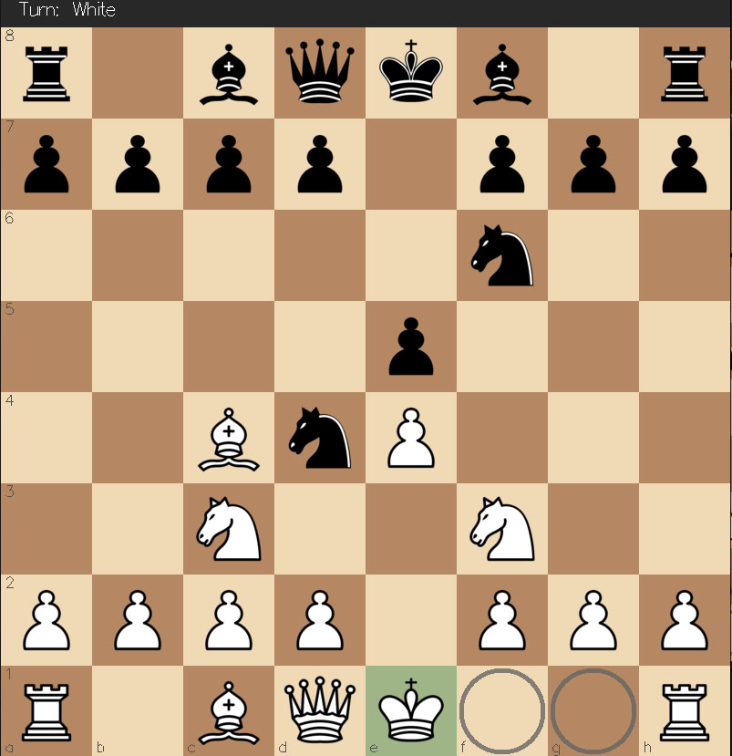
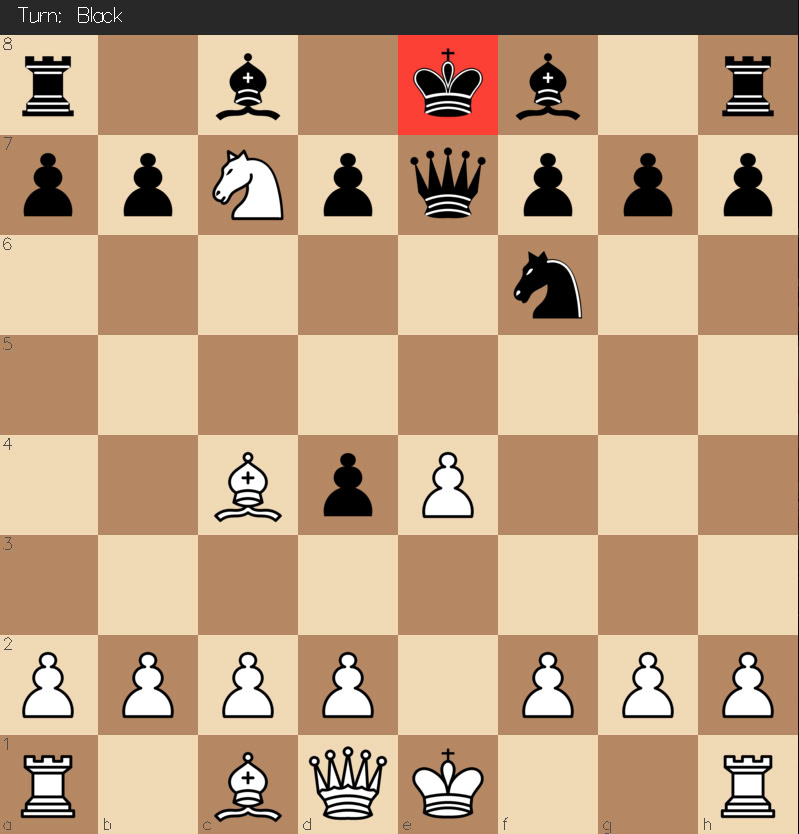
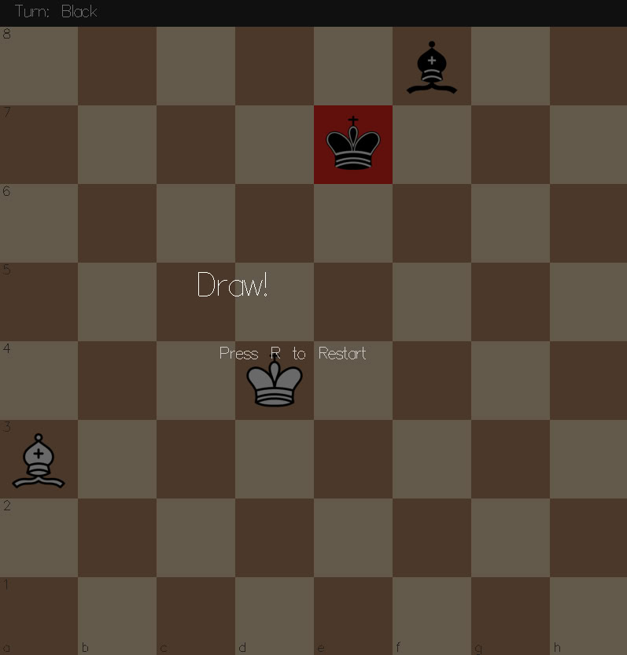

# Haskell-Chess-2026
## Chess project for Haskell practicum CMC MSU 2026

A fully functional, classic chess game written in Haskell using the `gloss` library for 2D rendering. This project implements strict validation for all chess rules, including complex mechanics, and features a user-friendly graphical interface for local hotseat multiplayer

<p align="center">
  
  
  
</p>

## Features
The game fully complies with the standard chess rules. Here is what you can do:
* **Play full matches**: Move pieces easily using mouse clicks;
* **Get visual hints**: Clicking on a piece highlights all its legal moves on the board;
* **Perform special moves**: Full support for *en passant* captures and castling (kingside and queenside);
* **Pawn Promotion**: A visual pop-up menu appears when a pawn reaches the back rank, allowing you to choose between a Queen, Rook, Bishop, or Knight;
* **Track game status**:
  * The King is highlighted in red when in check;
  * An on-screen turn indicator shows whose move it is (White or Black);
  * Automatic game-over detection: Checkmate, Stalemate, 50-move rule draw, and insufficient material draw.
* **Restart instantly**: Press the **`R`** key at any time to reset the board and start a new game.

## Project Structure
The codуbase is divided into modules for ease of maintenance and clear separation of tasks:
* **`Types.hs`** - core game data types
* **`Board.hs`** - board manipulation logic, coordinate parsing, and initial game setup
* **`Moves.hs`** - possible move generation for all piece types
* **`Rules.hs`** - the core logic engine: strict move validation, check/mate/stalemate detection, and implementation of special rules
* **`Render.hs`** - graphical rendering using the `gloss` library: drawing the board, active piece highlights, promotion menus, and game-over screens
* **`Events.hs`** - user input handling
* **`Lib.hs`** - the main application entry point

## Requirements

To build and run the project you need:

- **Stack** installed and available in `PATH`
- If you are not using Stack, a compatible **GHC 9.10.3** toolchain
- A graphical environment with **OpenGL** support
- The project assets available at runtime in `assets/pieces/*.bmp`

## How to run
1. Clone the repository: `git clone https://github.com/ovladisluvv/Haskell-Chess-2026.git`
2. Run these commands in your terminal:
```bash
stack build
stack exec chess-exe
```

## Credits

This project was a collaborative effort:
* **Game Logic & Rules** (move generation, check/mate validation, game state management) - Vladislav Ogai
* **Graphics & User Interface** (board rendering, highlights, mouse/keyboard event handling) - Abay Ismurzenov
