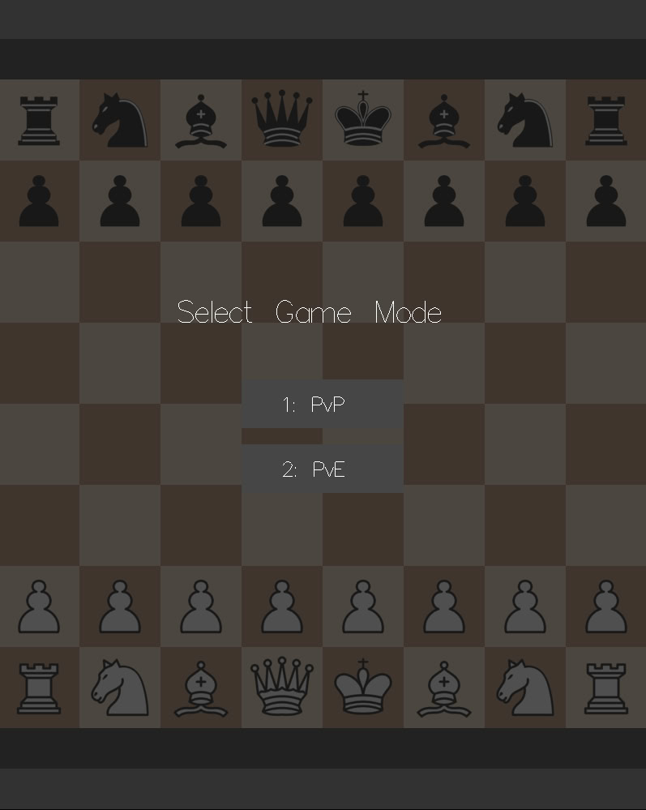

# Haskell-Chess-2026
## Chess project for Haskell practicum CMC MSU 2026

A fully functional, classic chess game written in Haskell using the `gloss` library for 2D rendering. This project implements strict validation for all chess rules, including complex mechanics, and features a user-friendly graphical interface for local hotseat multiplayer

<p align="center">
  
  
  
  
</p>

## Downloads
Prebuilt binaries are available on the **Releases** page. Current stable version: **v0.1.4**

## Features
The game fully complies with the standard chess rules. Here is what you can do:
* **Game Modes**: Play classic Player vs Player matches, or test your skills against the built-in bot. You can choose your color when playing against the bot
* **Smart bot**: The bot uses the Minimax algorithm with Alpha-Beta pruning, looking ahead to a depth of 4. It evaluates the board using both material value and piece-square tables (PST), dynamically adapting king safety for the endgame
* **Intuitive Controls**: Move pieces easily using mouse clicks, and use clickable on-screen buttons to undo moves or return to the menu
* **Get visual hints**: Clicking on a piece highlights all its legal moves on the board
* **Perform special moves**: Full support for *en passant* captures and castling (kingside and queenside)
* **Pawn Promotion**: A visual pop-up menu appears when a pawn reaches the back rank, allowing you to choose between a Queen, Rook, Bishop, or Knight
* **Track game status**:
  * The King is highlighted in red when in check
  * An on-screen turn indicator shows whose move it is (White or Black)
  * Dynamically displayed lists of captured pieces for both sides
  * Showed game history
  * Automatic game-over detection: Checkmate, Stalemate, 50-move rule draw, repetition and insufficient material draw
* **Hotkeys**:
  * **`Z`**: Undo the last move. The smart undo system automatically accounts for bot turns
  * **`R`**: Instantly reset the board and start a new game
  * **`M`**: Return to the Main Menu at any time
  * **`1`, `2`, `3`**: Quickly navigate through the menu

## Project Structure
The codebase is divided into modules for ease of maintenance and clear separation of tasks:
* **`Types.hs`** - core game data types
* **`Board.hs`** - board manipulation logic, coordinate parsing, and initial game setup
* **`Moves.hs`** - possible move generation for all piece types
* **`Rules.hs`** - the core logic engine: strict move validation, check/mate/stalemate detection, and implementation of special rules
* **`Bot.hs`** - artificial intelligence logic, piece-square evaluations, the Minimax search algorithm
* **`Render.hs`** - graphical rendering using the `gloss` library: drawing the board, active piece highlights, promotion menus, and game-over screens
* **`Events.hs`** - user input handling from mouse and keyboard, including menu states
* **`Lib.hs`** - the main application entry point

## Requirements
To build and run the project you need:

### Running a released build
- A supported desktop OS
- A graphical environment with OpenGL support
- The required runtime assets, if they are distributed separately from the executable

### Building from source
- **Stack** installed and available in `PATH`
- If you are not using Stack, a compatible **GHC 9.10.3** toolchain
- A graphical environment with **OpenGL** support
- The project assets available at runtime in `assets/pieces/*.bmp`

## How to run

### Option 1 - Run the latest release
1. Download the archive for your platform from **Releases**
2. Extract it completely
3. Run the executable from the extracted folder

### Option 2 - Build from source
1. Clone the repository:
   ```bash
   git clone https://github.com/ovladisluvv/Haskell-Chess-2026.git
   cd Haskell-Chess-2026
   ```
2. Run these commands in your terminal:
   ```bash
   stack build
   stack exec chess-exe
   ```

## Credits

This project was a collaborative effort:
* **Game Logic, Rules & Bot** (move generation, check/mate validation, game state management, Minimax Alpha-Beta bot) - Vladislav Ogai
* **Graphics & User Interface** (board rendering, highlights, mouse/keyboard event handling) - Abay Ismurzenov
